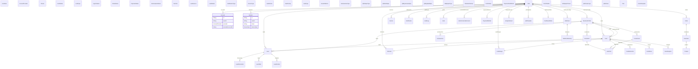

```mermaid
erDiagram
    %% ENUMS
    UserRole {}
    AccountProvider {}
    Theme {}
    CardStatus {}
    CardType {}
    LogoPosition {}
    OrderStatus {}
    PaymentStatus {}
    SubscriptionStatus {}
    PlanTier {}
    LeadSource {}
    LeadStatus {}
    NotificationType {}
    DeviceType {}
    AuditAction {}
    TaskPriority {}
    GoalType {}
    SocialPlatform {}
    ExtraSectionType {}
    QRShapeType {}
    QRDotShape {}
    QREyeFrameStyle {}
    QREyeBallStyle {}
    WallpaperType {}
    ShadowIntensity {}
    FontFamily {}
    PaymentCardBrand {}

    %% USER & AUTHENTICATION
    User ||--o{ Account : "accounts"
    User ||--o{ Session : "sessions"
    User ||--o{ BusinessProfile : "businessProfiles"
    User ||--o{ Card : "cards"
    User ||--o{ Order : "orders"
    User ||--o{ Invoice : "invoices"
    User ||--o{ Notification : "notifications"
    User ||--o{ AuditLog : "auditLogs"
    User ||--o{ Lead : "leads"
    User ||--o{ Goal : "goals"
    User ||--o{ UserConnectedAccount : "connectedAccounts"
    User ||--o{ PaymentMethod : "paymentMethods"
    User ||--o{ Webhook : "webhookConfigs"
    User ||--o{ AnalyticsEvent : "analyticsEvents"
    User ||--o{ NfcCard : "nfcCards"
    User ||--o{ CardDesign : "cardDesigns"
    User ||--o{ QRTemplate : "qrTemplates"
    User ||--o| DashboardStats : "dashboardStats"

    Account {
        String id
        String userId
        AccountProvider provider
        String providerAccountId
    }

    Session {
        String id
        String userId
        String token
        DeviceType deviceType
    }

    %% BUSINESS PROFILE
    BusinessProfile ||--o{ Card : "cards"
    BusinessProfile ||--o{ SocialLink : "socialLinks"
    BusinessProfile ||--o{ CustomLink : "customLinks"
    BusinessProfile ||--o{ ExtraSection : "extraSections"
    BusinessProfile ||--o{ Lead : "leads"

    SocialLink ||--o{ LinkClick : "linkClicks"
    CustomLink ||--o{ LinkClick : "linkClicks"

    %% DIGITAL BUSINESS CARDS
    Card ||--o{ CardInteraction : "interactions"
    Card ||--o{ CardShare : "shares"
    Card ||--o{ CardAnalytics : "analytics"
    Card ||--o{ Lead : "leads"
    Card ||--o{ LinkClick : "linkClicks"
    Card ||--o| NfcCard : "nfcCard"
    Card }o--|| BusinessProfile : "businessProfile"
    Card }o--|| CardDesign : "design"

    CardDesign {}

    ColorPalette {}
    WallpaperPreset {}

    %% QR CODE CONFIGURATION
    QRTemplate {}
    QRPresetLogo {}
    QRSticker {}

    %% CARD INTERACTIONS & ANALYTICS
    CardInteraction {}
    CardShare {}
    CardAnalytics {}
    LinkClick {}

    %% LEADS & CONTACT MANAGEMENT
    Lead ||--o{ LeadInteraction : "interactions"
    Lead ||--o{ LeadTask : "tasks"
    Lead ||--o{ LeadActivity : "activities"

    LeadInteraction {}
    LeadTask {}
    LeadActivity {}

    %% BILLING & SUBSCRIPTIONS
    Order ||--o{ OrderItem : "orderItems"
    OrderItem ||--|| Product : "product"
    Product {}
    Invoice {}
    PaymentMethod {}
    Plan {}

    %% GOALS & TARGETS
    Goal {}

    %% NOTIFICATIONS
    Notification {}

    %% CONNECTED ACCOUNTS
    UserConnectedAccount {}

    %% NFC CARDS (Physical)
    NfcCard {}

    %% ANALYTICS EVENTS
    AnalyticsEvent {}

    %% DASHBOARD STATISTICS
    DashboardStats {}

    %% AUDIT LOG
    AuditLog {}

    %% EMAIL & NOTIFICATIONS TEMPLATES
    EmailTemplate {}

    %% WEBHOOKS
    Webhook ||--o{ WebhookDelivery : "deliveries"
    WebhookDelivery {}
```
